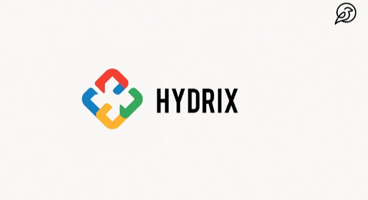

# Hydrix
Hydrix is one of the most powerful and beginner-friendly programming languages. It is designed in a way that makes it very easy for new programmers to learn and start coding. Hydrix can be applied in multiple fields such as website development, web applications, data analysis, data science, and more.

This language is built by combining the core concepts of Python, C++, C, and Java, forming a unique beginner-friendly structure. Its main feature is the function keyword-based design, which makes the syntax simple and understandable for beginners.

Hydrix is being developed by Univer LLC and is a closed-source language. The code can only be executed through the Hydrix Engine, and it is not compatible with external compilers or interpreters. This makes Hydrix a fully unique ecosystem that runs entirely on its own engine.

# Official Release

Since Hydrix is a closed-source language and can only be executed using the Hydrix Engine, developers will need the Hydrix Engine to write and run Hydrix code.

Currently, the Hydroxide Engine has not yet been officially released to the public, and no official public release date has been confirmed. Until now, Hydroxide Engine and the language itself have only been used internally at Univer LLC.

However, Univer LLC has officially announced that the Hydroxide Engine and Hydrix Language will be released to the public very soon. Once released, developers and beginners worldwide will be able to access and experience Hydrix.

# Installation

Hydrix is a closed-source language, which means that to use it, you must have the Hydroxide Engine. It does not support any other platform or editor, such as VS Code, Replit, or any other IDE.

Below, in the Release section, you will find the download links for Hydroxide Engine for Windows and Android.

# usages
 
<b>fronted</b>
<li>Website Design</li>
<li>Application UI & UX Development </li>
  
<b>Backend</b>
 
<li>Website Backend Logic</li>
<li>Application Backend Logic
Automation</li>
Web Applications
<li>Artificial Intelligence</li>
<li>Data Science</li>
<li>Data Analysis</li>
<li>Programming Robots</li>

# hydroxide engine workflow
 

  
Humans use different natural languages to express thoughts — such as Japanese, Chinese, Spanish, or English. But computers cannot directly understand any human language, whether it is English or Chinese. Computers communicate in their own language called Binary Code, which is built entirely from 0s and 1s.

However, humans are not naturally good at working directly with numbers like binary. That is why programming languages were created —to allow humans to use readable characters and structures to communicate more effectively with computers.

Among these programming languages, Hydrix is designed to be one of the most powerful yet beginner friendly. Like every programming language, Hydrix requires an environment to be written and executed. Such an environment is called a code editor or code engine. Popular platforms like VS Code or Replit are commonly used for other languages, but Hydrix is different.

Hydrix can only be understood and executed within the Hydroxide Engine. When a user writes Hydrix code inside the Hydroxide Engine and runs it, the engine converts the Hydrix code into binary code. This binary code is what the computer can finally understand and execute.

# feature 
<b>Plugin Support –</b> Developers can install and use different plugins, making the engine more customizable, easy to use, and highly accessible.

<b>Element Suggestions (IntelliSense) – </b> Smart suggestions for functions, variables, and elements while writing code.

<b> Syntax Highlighting</b> – Clear and colorful syntax highlighting to improve readability.

<b>Code Auto-Completion – </b>Automatically completes functions, keywords, and variables as you type.

<b>Error Detection & Debugging –</b> Real-time error highlighting and debugging tools to help developers fix issues faster.

<b>Built-in Terminal –</b> Run commands and scripts directly within the engine.

<b>File Explorer –</b> Manage and navigate project files easily inside the engine.

<b> Cross-Platform Support – </b> Designed to work on both Windows and Android (future updates may add more platforms).

<b> Lightweight & Fast – <b/> Optimized for performance, so beginners and professionals can code without lag.

